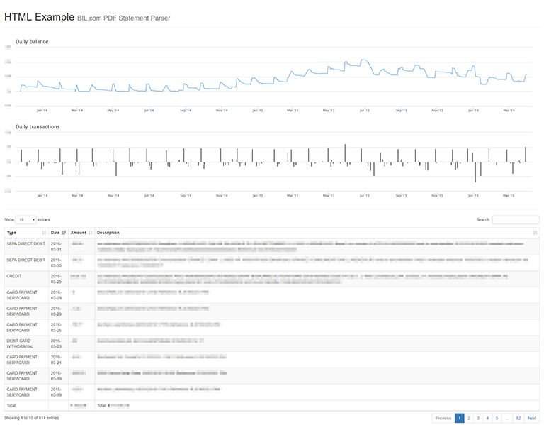

# BIL PDF statement parser

This application is capable of processing multiple PDF statements, downloaded
from the bil.com online banking application to create a single CSV or HTML page
from the extracted transactions.

## 1. Installation

Note: I have only tested with the following versions, sorry. :)

```
$ cat /etc/os-release | grep PRETTY
PRETTY_NAME="Ubuntu 14.04.4 LTS"

$ php -v
PHP 5.6.19-1+deb.sury.org~trusty+1 (cli)
Copyright (c) 1997-2016 The PHP Group
Zend Engine v2.6.0, Copyright (c) 1998-2016 Zend Technologies
    with Zend OPcache v7.0.6-dev, Copyright (c) 1999-2016, by Zend Technologies
    with Xdebug v2.3.3, Copyright (c) 2002-2015, by Derick Rethans

$ dpkg -l | grep poppler-utils
ii  poppler-utils  0.24.5-2ubuntu4.3  amd64  PDF utilities (based on Poppler)
```

### 1.1. Requirements

I didn't find a PHP native solution that was able to provide a deterministic extraction
of these PDF files, so I ended up with the poppler-utils provided **pdftohtml** application,
as it is able to extract the text into xml, which allows the parsing with a small state machine
logic, line-by-line.

```sudo apt-get install pdftohtml```

### 1.2. Setup

```composer require tommey/bil-pdf-statement-parser```

## 2. Usage

### 2.1. Examples

You can find two examples for the usage:

1. **Batch script**, which prints out CSV format:
   ```php batch/bil-pdf-statement-csv.php <your directory with pdf files>```
2. **Web page**, which show the transactions in HTML format:
   ```php -S localhost:8080 -t /path/to/this/repo/web```
   then open http://localhost:8080/bil-pdf-statement-html.php
   

### 2.2. Custom usage

The public interface is provided by the ```BilPdfStatementParser``` class via static factory methods.

You can easily create your own formatter, by implementing the ```TransactionListFormatterInterface```.

See for example classes under ```src/Formatter``` for:

* CSV
* HTML
* JSON
* Highcharts

## 3. Contribution

Feel free to file bugs or fix them right away and send a pull request. :-)

## 4. License

MIT License

Copyright (c) 2016 Tamás Tóth
